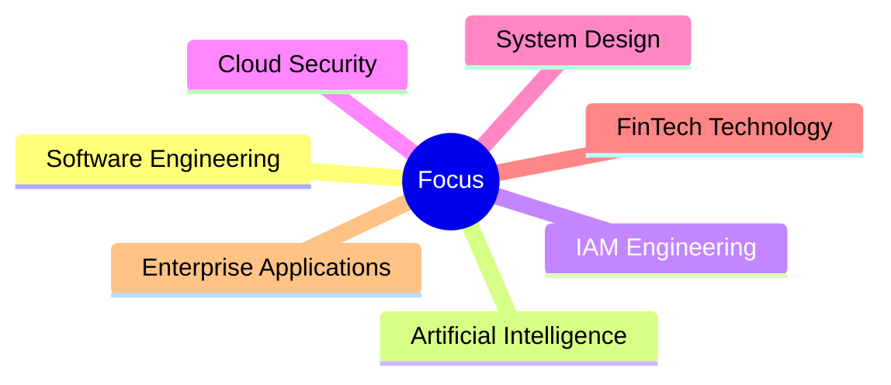

# Software Engineer • AI Product Builder • IAM Enthusiast

 

Building intelligent software platforms, AI-powered products, workflow automation systems, and enterprise identity solutions.

---

# About

I build scalable software systems focused on Artificial Intelligence, Identity & Access Management, Cloud Technologies, Enterprise Security, and Workflow Automation.

My interests include:

- Software Engineering
- Identity & Access Management (IAM)
- Artificial Intelligence
- Full Stack Development
- Cloud Computing
- System Design
- Enterprise Security
- FinTech Technology

---

# Featured Projects

<table>
<tr>

<td width="33%">

## AutoFlow AI

Universal Workflow Visualization Platform

AI-powered workflow analysis engine that transforms code, project requirements, business processes, and system architectures into intelligent visual workflows.

</td>

<td width="33%">

## Smart IAM Portal

Enterprise Identity & Access Management Platform

Authentication, Authorization, Role-Based Access Control (RBAC), User Lifecycle Management, and Security Governance.

</td>

<td width="33%">

## FinSecure

FinTech Security Platform

Secure access control, transaction authorization, audit monitoring, authentication flows, and enterprise security architecture.

</td>

</tr>
</table>

---

# Technology Stack

<table>
<tr>
<td align="center">Java</td>
<td align="center">Python</td>
<td align="center">JavaScript</td>
<td align="center">C</td>
<td align="center">C++</td>
</tr>

<tr>
<td align="center">React</td>
<td align="center">HTML</td>
<td align="center">CSS</td>
<td align="center">Tailwind</td>
<td align="center">TypeScript</td>
</tr>

<tr>
<td align="center">Spring Boot</td>
<td align="center">FastAPI</td>
<td align="center">Node.js</td>
<td align="center">REST APIs</td>
<td align="center">JWT</td>
</tr>

<tr>
<td align="center">MySQL</td>
<td align="center">PostgreSQL</td>
<td align="center">MongoDB</td>
<td align="center">Git</td>
<td align="center">GitHub</td>
</tr>

<tr>
<td align="center">AWS</td>
<td align="center">Azure</td>
<td align="center">Docker</td>
<td align="center">OAuth2</td>
<td align="center">RBAC</td>
</tr>

</table>

---

# Current Focus

---

# GitHub Analytics

 

---

# Professional Interests

- Software Engineer
- IAM Engineer
- Backend Engineer
- Cloud Engineer
- Security Engineer
- AI Engineer
- FinTech Technology

---

# Connect

---

### Building Scalable Software • Secure Systems • Intelligent Products

